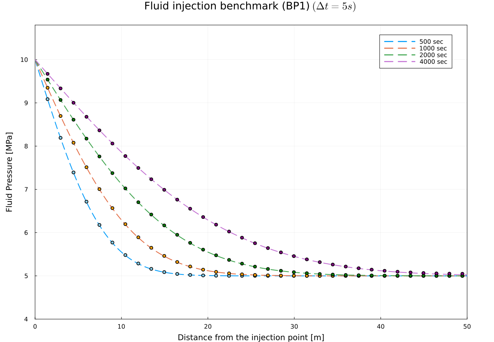

# Fluid Injection Benchmark (BP1)

We reproduced the fluid injection benchmark (BP1) in a 2D-strike slip fault as in [Luca et al. 2022](https://www.sciencedirect.com/science/article/pii/S0040195122003109). The benchmark serves to test the solid-fluid interaction in our coupled physical system.

In this simple benchmark our solver consists of the fully compressible mass conservation equations for both solid and fluid, and momentum equations for both solid and fluid neglecting inertia effects.


## Accurate numerical solution

Using the new damping scheme for the stokes equation while keeping the same formulation for fluid mass and momentum equations, we can achieve a highly accurate numerical solution against the analytical solution as in [Viesca 2021](https://doi.org/10.1017/jfm.2021.825).


We used following parameters in the benchmark performed, which were kept identical for the analytical and the numerical solution. 

```julia
    P₀  = 5e6         # [Pa] initial pore pressure                   p(x,0)    = P₀ 
    Δpf = 5e6         # [Pa] injection proceeds at constant pressure p(0, t>0) = Δp
    ηf  = 1e-3        # [Pa·s] viscosity of the permeating fluid
    kᵩ  = 1e-15       # [m²]   Darcy permeability of the layer    (table 1 value) -> calcuated from kᵩ = k* (φ)
    
    # calculated from values in table 1 with βs = 2.5e-11, βf = 4.0e-10 (see Dal Zilio et al. 2022)
    βd  = 2.5555555555555557e-11   # drained compressibility of the porous medium

```





The physical time step size was selected to be `Δt = 5` (s). Our numerical solution identically overlap with the analytical solution, at `nx = 1001` grid points which we set along the fault.


## Animation

We also provide an animation of the same benchmark run.


