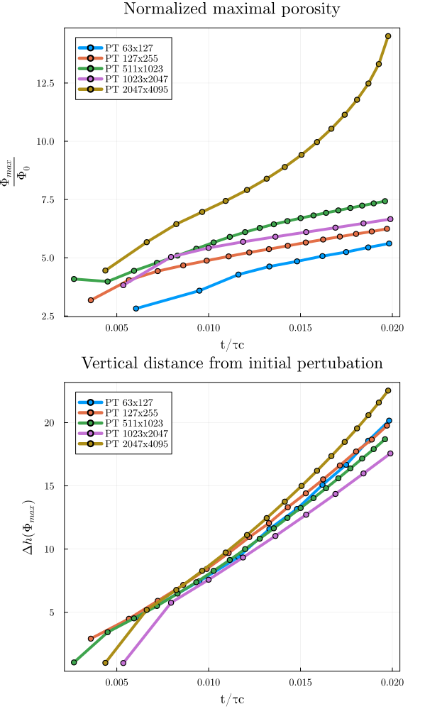
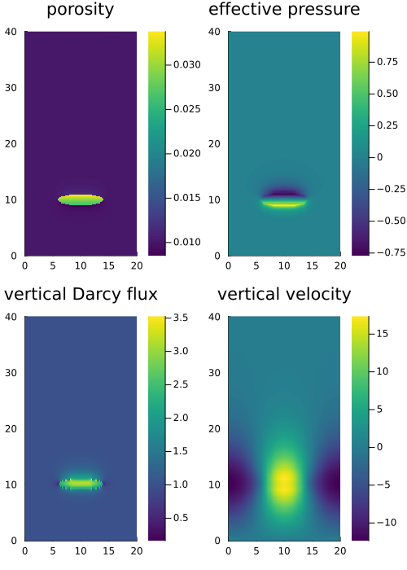
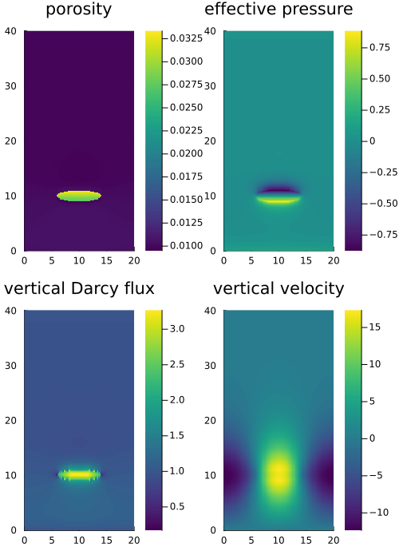

# Benchmarks

Followingly are some selected benchmark runs performed using the hydro-mechanical solver.

## Porosity wave benchmark

Using the decompaction weakening approach as in [Raess et al.](https://academic.oup.com/gji/article/218/3/1591/5497299?login=true). We set up the benchmark for the porosity wave regime as limit of two-phase flow. The goal of this benchmark is to verify the reproducibility of the methodology as described [here](methodology.md)

### Influence of spatial resolution

We keep all the parameters identical as in Räss et al. 2019 and perform 5 experiments with increasing grid resolution.

It is important to point out that the spatial resolution plays a very important role in our simulation. We reported here a plot consisting of the final porosity distribution $\log_{10}(\frac{\phi}{\phi_0})$ of the 5 experiments.


We notice the similarities between the last two experiments of the highest resolution and observed the evolved two-channel morphology during time evolution. However, the last experiment also deviates from previous results of lower resolutions that it does not show very significant evolution of secondary channels and it shows the unique "merging" effect of the two-channel flow into a single channel when reaching 85% of the domain height.




We identify the experiment 5 as an outlier in the figure above, where we further investigated the evolution of the normalized maximal porosity $\frac{\phi_{\text{max}}}{\phi_0}$ and the vertical distance of the point posessing the maximal value of porosity from initial pertubation $\Delta h (\Phi_{\text{max}})$. 

It is yet unclear whether this is a sign showing that the method converges or this blow-up phenomenon is brought by the accumulation of the numerical errors. The latter assumption is highly possible. With a total simulation time of t = 0.02, we performed 3296 iterations with a time step size of magnitude $10^{-6}$, we could probably have reached machine precision3 by performing any arithmetic operations that involve it, which then can introduce roundoff errors,which are highly undesirable. Further investigations are needed by performing roundoff analysis and running simulations with even higher resolutions.


In the following section we report the evolution of porosity waves in the performed five experiments.

---

- Experiment 1: `nx = 63`, `ny = 127`

```bash
# last 10 iterations
it = 905, time = 2.181e-01 sec (@ T_eff = 5.60 GB/s) 
it = 906, time = 2.182e-01 sec (@ T_eff = 5.60 GB/s) 
it = 907, time = 2.212e-01 sec (@ T_eff = 5.50 GB/s) 
it = 908, time = 2.200e-01 sec (@ T_eff = 5.50 GB/s) 
it = 909, time = 2.192e-01 sec (@ T_eff = 5.60 GB/s) 
it = 910, time = 2.187e-01 sec (@ T_eff = 5.60 GB/s) 
it = 911, time = 2.170e-01 sec (@ T_eff = 5.60 GB/s) 
it = 912, time = 2.197e-01 sec (@ T_eff = 5.50 GB/s) 
it = 913, time = 2.193e-01 sec (@ T_eff = 5.60 GB/s) 
it = 914, time = 2.192e-01 sec (@ T_eff = 5.60 GB/s) 
it = 915, time = 1.819e-01 sec (@ T_eff = 5.60 GB/s)
```


- Experiment 2: `nx = 127`, `ny = 255`

```bash
# last 10 iterations
it = 1526, time = 5.757e-01 sec (@ T_eff = 22.00 GB/s) 
it = 1527, time = 6.306e-01 sec (@ T_eff = 20.00 GB/s) 
it = 1528, time = 5.753e-01 sec (@ T_eff = 22.00 GB/s) 
it = 1529, time = 5.386e-01 sec (@ T_eff = 21.00 GB/s) 
it = 1530, time = 5.775e-01 sec (@ T_eff = 20.00 GB/s) 
it = 1531, time = 5.663e-01 sec (@ T_eff = 20.00 GB/s) 
it = 1532, time = 5.366e-01 sec (@ T_eff = 22.00 GB/s) 
it = 1533, time = 5.366e-01 sec (@ T_eff = 22.00 GB/s) 
it = 1534, time = 5.767e-01 sec (@ T_eff = 20.00 GB/s) 
it = 1535, time = 5.330e-01 sec (@ T_eff = 22.00 GB/s) 
it = 1536, time = 5.332e-01 sec (@ T_eff = 22.00 GB/s) 
```


- Experiment 3: `nx = 511`, `ny = 1023`


```bash
# last 10 iterations
it = 2055, time = 2.922e+00 sec (@ T_eff = 110.00 GB/s) 
it = 2056, time = 2.919e+00 sec (@ T_eff = 110.00 GB/s) 
it = 2057, time = 2.917e+00 sec (@ T_eff = 110.00 GB/s) 
it = 2058, time = 2.898e+00 sec (@ T_eff = 120.00 GB/s) 
it = 2059, time = 2.914e+00 sec (@ T_eff = 110.00 GB/s) 
it = 2060, time = 2.915e+00 sec (@ T_eff = 110.00 GB/s) 
it = 2061, time = 2.915e+00 sec (@ T_eff = 110.00 GB/s) 
it = 2062, time = 2.919e+00 sec (@ T_eff = 110.00 GB/s) 
it = 2063, time = 2.919e+00 sec (@ T_eff = 110.00 GB/s) 
it = 2064, time = 2.918e+00 sec (@ T_eff = 110.00 GB/s) 
it = 2065, time = 2.896e+00 sec (@ T_eff = 120.00 GB/s) 
```


- Experiment 4: `nx = 1023`, `ny = 2047`

```bash
# last 10 iterations
it = 1804, time = 9.881e+00 sec (@ T_eff = 140.00 GB/s) 
it = 1805, time = 9.914e+00 sec (@ T_eff = 130.00 GB/s) 
it = 1806, time = 9.940e+00 sec (@ T_eff = 130.00 GB/s) 
it = 1807, time = 9.911e+00 sec (@ T_eff = 130.00 GB/s) 
it = 1808, time = 9.925e+00 sec (@ T_eff = 130.00 GB/s) 
it = 1809, time = 9.913e+00 sec (@ T_eff = 130.00 GB/s) 
it = 1810, time = 9.926e+00 sec (@ T_eff = 130.00 GB/s) 
it = 1811, time = 9.924e+00 sec (@ T_eff = 130.00 GB/s) 
it = 1812, time = 9.888e+00 sec (@ T_eff = 140.00 GB/s) 
it = 1813, time = 9.934e+00 sec (@ T_eff = 130.00 GB/s) 
it = 1814, time = 9.909e+00 sec (@ T_eff = 130.00 GB/s) 
```


- Experiment 5: `nx = 2047`, `ny = 4095`

```bash
# last 10 iterations
it = 3286, time = 3.414e+01 sec (@ T_eff = 160.00 GB/s) 
it = 3287, time = 3.411e+01 sec (@ T_eff = 160.00 GB/s) 
it = 3288, time = 3.415e+01 sec (@ T_eff = 160.00 GB/s) 
it = 3289, time = 3.412e+01 sec (@ T_eff = 160.00 GB/s) 
it = 3290, time = 3.418e+01 sec (@ T_eff = 160.00 GB/s) 
it = 3291, time = 3.413e+01 sec (@ T_eff = 160.00 GB/s) 
it = 3292, time = 3.412e+01 sec (@ T_eff = 160.00 GB/s) 
it = 3293, time = 3.408e+01 sec (@ T_eff = 160.00 GB/s) 
it = 3294, time = 3.412e+01 sec (@ T_eff = 160.00 GB/s) 
it = 3295, time = 3.409e+01 sec (@ T_eff = 160.00 GB/s) 
it = 3296, time = 3.412e+01 sec (@ T_eff = 160.00 GB/s) 
```

We also report the evolution of the porosity wave at different time steps in the following plot, reporting the normalized porosity $\log_{10}(\frac{\phi}{\phi_0})$ along with the colorbar used for the heatmap plotting. As we can see in the subplots, the evolution of the secondary channels is much less significant and are only visible in latter evolution phases as in (e), (f) subplots. The two-channel morphology also converges to a single-channel morphology at the end of the simulation unlike in previous four experiments.


---

### Influence of compressibility in mass conservation equations

#### Incompressible

*Resulting animation of the code provided in the [`HydroMech2D.jl`](https://github.com/omlins/ParallelStencil.jl/blob/main/miniapps/HydroMech2D.jl), which is the starting point of our implementation of the solver.*

`R=500`, `t=0.02`


`R=1.0`, `t=0.2`




#### Compressible

*Followingly are the (truncated) results using the same model setup but with additional physical variables added for the compressible terms of the mass conservation equation*

`R=1000`


`R=500`


`R=1.0`, `t=0.03`




```julia
# dimensionalized parameters used in (Dal Zilio et al. 2022)
µ = 25G*Pa            # shear modulus
Ks = 50G*Pa           # bulk modulus
βs = 2.5 10^-11 1/Pa  # solid compressibility
βf = 4.0 10^-10 1/Pa  # fluid compressibility
```


## Fluid injection 2D benchmark


Reproduce fluid injection 2D benchmark in [Luca et al. 2022](https://www.sciencedirect.com/science/article/pii/S0040195122003109)